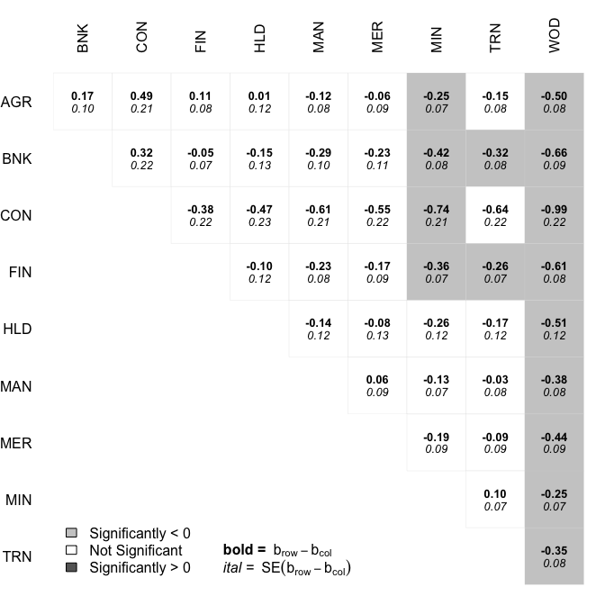

<!-- README.md is generated from README.Rmd. Please edit that file -->

# factorplot 

`factorplot` is an R package that helps visualize pairwise comparisons.
It is particularly useful as a post-estimation technique following a
(G)LM, multinomial logistic regression or any other multiple comparison
procedure done with
[multcomp](https://CRAN.R-project.org/package=multcomp). A more thorough
discussion of the method and what it produces are
[here](https://journal.r-project.org/archive/2013-2/armstrong.pdf).

The basic idea is that often when variables with multiple categories are
used in regression models, we want to know not only the difference
between each category and the reference group, but we want to know the
differences in all possible pairs of values of that variable. There are
lots of methods out there for doing just that, but I developed the
`factorplot` package to be simple to decode relative to its competitors.
Here are a few examples of where the `factorplot` package could be
useful.

### (G)LM Coefficients.

To show how the `factorplot` function works for (G)LM coefficients, we
are going to use the `Ornstein` data from the `carData` package. Here
the outcome is interlocking firm memberships and the independent
variables are the log of assets, the nation in which the firm resides
and the sector in which the firm operates.

``` r
library(factorplot)
data(Ornstein, package="carData")
mod <- glm(interlocks ~ log(assets) + sector + nation, 
           data=Ornstein, family=poisson)
summary(mod)
#> 
#> Call:
#> glm(formula = interlocks ~ log(assets) + sector + nation, family = poisson, 
#>     data = Ornstein)
#> 
#> Deviance Residuals: 
#>     Min       1Q   Median       3Q      Max  
#> -6.7111  -2.3159  -0.4595   1.2824   6.2849  
#> 
#> Coefficients:
#>             Estimate Std. Error z value Pr(>|z|)    
#> (Intercept) -0.83938    0.13664  -6.143 8.09e-10 ***
#> log(assets)  0.45145    0.01698  26.585  < 2e-16 ***
#> sectorBNK   -0.16651    0.09575  -1.739 0.082036 .  
#> sectorCON   -0.48928    0.21320  -2.295 0.021736 *  
#> sectorFIN   -0.11161    0.07571  -1.474 0.140457    
#> sectorHLD   -0.01491    0.11924  -0.125 0.900508    
#> sectorMAN    0.12187    0.07614   1.600 0.109489    
#> sectorMER    0.06157    0.08670   0.710 0.477601    
#> sectorMIN    0.24985    0.06888   3.627 0.000286 ***
#> sectorTRN    0.15181    0.07893   1.923 0.054453 .  
#> sectorWOD    0.49825    0.07560   6.590 4.39e-11 ***
#> nationOTH   -0.10699    0.07438  -1.438 0.150301    
#> nationUK    -0.38722    0.08951  -4.326 1.52e-05 ***
#> nationUS    -0.77239    0.04963 -15.562  < 2e-16 ***
#> ---
#> Signif. codes:  0 '***' 0.001 '**' 0.01 '*' 0.05 '.' 0.1 ' ' 1
#> 
#> (Dispersion parameter for poisson family taken to be 1)
#> 
#>     Null deviance: 3737.0  on 247  degrees of freedom
#> Residual deviance: 1547.1  on 234  degrees of freedom
#> AIC: 2473.1
#> 
#> Number of Fisher Scoring iterations: 5
```

The `factorplot` function initially produces no output, but calculates
all of the pairwise comparisons.

``` r
f <- factorplot(mod, factor.var="sector")
```

There are print, summary and plotting methods for the `factorplot`
object. The print method has an optional argument `sig`, which if set to
`TRUE` only prints significant differences.

``` r
print(f, digits=3, sig=TRUE)
#>           Difference    SE p.val
#> AGR - CON      0.489 0.213 0.023
#> CON - HLD     -0.474 0.235 0.045
#> BNK - MAN     -0.288 0.102 0.005
#> CON - MAN     -0.611 0.215 0.005
#> FIN - MAN     -0.233 0.082 0.005
#> BNK - MER     -0.228 0.106 0.032
#> CON - MER     -0.551 0.220 0.013
#> AGR - MIN     -0.250 0.069 0.000
#> BNK - MIN     -0.416 0.084 0.000
#> CON - MIN     -0.739 0.210 0.001
#> FIN - MIN     -0.361 0.067 0.000
#> HLD - MIN     -0.265 0.118 0.026
#> MER - MIN     -0.188 0.085 0.029
#> BNK - TRN     -0.318 0.082 0.000
#> CON - TRN     -0.641 0.217 0.004
#> FIN - TRN     -0.263 0.070 0.000
#> AGR - WOD     -0.498 0.076 0.000
#> BNK - WOD     -0.665 0.095 0.000
#> CON - WOD     -0.988 0.215 0.000
#> FIN - WOD     -0.610 0.077 0.000
#> HLD - WOD     -0.513 0.121 0.000
#> MAN - WOD     -0.376 0.080 0.000
#> MER - WOD     -0.437 0.090 0.000
#> MIN - WOD     -0.248 0.072 0.001
#> TRN - WOD     -0.346 0.081 0.000
```

The summary method identifies the number of significant positive,
significant negative and insignificant differences with other stimuli.

``` r
summary(f)
#>     sig+ sig- insig
#> AGR    1    2     6
#> BNK    0    5     4
#> CON    0    7     2
#> FIN    0    4     5
#> HLD    1    2     6
#> MAN    3    1     5
#> MER    2    2     5
#> MIN    6    1     2
#> TRN    3    1     5
#> WOD    9    0     0
```

The plotting method colors each box according to whether and how each
difference is significant. For example, the dark-gray box at the nexus
of the `AGR` and `CON` row and column, respectively, indicates that the
agriculture sector has significantly more interlocking board memberships
than does the construction sector. The light-gray boxes indicate that
the difference is significant in favor of the column rather than the
row.

``` r
plot(f)
```


The default means for adjusting for multiplicity is to do nothing, but
all of the options of `p.adjust` are available.

``` r
f <- factorplot(mod, factor.var="sector", adjust.method="holm")
plot(f)
```


### GLHT objects.

For those using the `glht()` function from `multcomp`, the `factorplot`
function works for these objects, too.

``` r
g <- glht(mod, linfct = mcp("sector" = "Tukey"))
s <- summary(g)
plot(factorplot(s))
```



### Multinomial Logit Coefficients

One of the biggest problems with interpreting multinomial logit
coefficients is that the reference category problem applies to all
variables because it is a function not only of potentially some
independent variables, but also of the dependent variable. Here the
`factorplot` function can help.

``` r
data("Chile", package="carData")
library(nnet)
mod <- multinom(vote ~ age + sex + education, data=Chile)
#> # weights:  24 (15 variable)
#> initial  value 3494.848084 
#> iter  10 value 3121.795602
#> iter  20 value 3077.986718
#> final  value 3077.985852 
#> converged
summary(mod)
#> Call:
#> multinom(formula = vote ~ age + sex + education, data = Chile)
#> 
#> Coefficients:
#>   (Intercept)        age        sexM educationPS educationS
#> N   1.0928913 0.00601010  0.58599491   0.3288071 -0.2398034
#> U   0.9496712 0.02041244 -0.24447512  -1.0294778 -0.6974096
#> Y   1.1850035 0.02082591  0.01426536  -0.4851798 -0.7827258
#> 
#> Std. Errors:
#>   (Intercept)         age      sexM educationPS educationS
#> N   0.3088481 0.006303204 0.1628414   0.2501653  0.1976728
#> U   0.3166930 0.006485748 0.1717826   0.2778410  0.2012233
#> Y   0.3059721 0.006264887 0.1640342   0.2536581  0.1954040
#> 
#> Residual Deviance: 6155.972 
#> AIC: 6185.972
```

In the above, the effect of age is the effect of `sexM` is the effect on
the binary choice between the reference (Abstain) and each non-reference
level. We can see the effects for all pairs of levels with `factorplot`.

``` r
f <- factorplot(mod, variable="sexM")
plot(f)
```


Notice that the factorplot shows that all of the differences between
non-reference categories are statistically significant. As shown above,
one way to specify the `factorplot` for multinomial logit objects is to
give the name of a single regressor. You can also provide the name of a
term, for example `education`, which has multiple regressors in the
model. Here, there is a single heading for `Reference`. The reference
here stands in for not only the reference group of `education` in the
non-reference dependent variable categories, but also for all education
categories in the dependent variable reference category. This makes
sense because all of these parameters are set to 0 for identification
purposes. Here is the plot for education:

``` r
f <- factorplot(mod, variable="education")
plot(f)
```


The default method for `factorplot` will also take as the argument to
`obj` a vector of estimates and a variance-covariance matrix of the
estimates as the `var` argument. Using this method, you could plot
factorplots for any estimates you might want.
